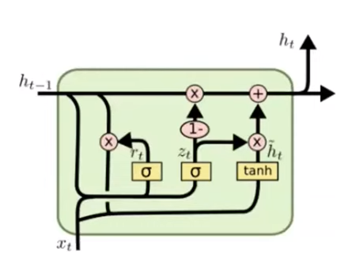

# GRU Sentiment Analysis from Scratch  

## Overview  
This project implements a **GRU (Gated Recurrent Unit) model from scratch** for **sentiment analysis** on the IMDb dataset. The entire model is built from the ground up, including the GRU cell, training pipeline, and tokenization.  

## Key Features  
- **GRU Implemented from Scratch** – No external libraries for GRU layers were used.  
- **Trained Completely from Scratch** – Starting with random weights, the model was trained efficiently.  
- **Loss Reduced from 4.2 to 0.151** – Achieved significant improvement in training loss.  
- **Byte Pair Encoding (BPE) Tokenizer** – Used for efficient text representation.  
- **Batch Training with DataLoader** – Improved training efficiency with mini-batches.  
- **TQDM Progress Bar** – Added for better tracking of training progress.  

## Training Process  
- The model was trained on the **full IMDb dataset** (`imdb_small.csv`).  
- Used **Binary Cross-Entropy Loss (BCELoss)** for classification.  
- Optimized using **Adam Optimizer** with a learning rate of `0.001`.  
- Training was run for **5 epochs** with a **batch size of 32**.  

## Model Performance  
- Achieved a final **training loss of 0.151** after starting at **4.2**.  
- The model successfully classifies reviews into **positive** and **negative** sentiments.  

## Tokenization  
- Implemented **Byte Pair Encoding (BPE)** for tokenization.  
- Vocabulary size: **10,000** words.  
- Maximum sequence length: **200 tokens** per review.  

## Testing  
- The model was tested on **custom inputs** as well as the full dataset.  
- Includes **a script for batch testing** with a progress bar (`tqdm`).  

## Model Architecture

The sentiment analysis model is based on a **GRU (Gated Recurrent Unit)** architecture, which is an efficient variant of Recurrent Neural Networks (RNNs) for processing sequential data. The model consists of the following components:

### GRU Cell

The **GRUCell** is implemented from scratch to form the core building block of the model. The GRU cell consists of three primary gates:

1. **Update Gate (z_t)**: Controls the degree to which the previous hidden state is retained.
2. **Reset Gate (r_t)**: Determines how much of the previous hidden state should be forgotten.
3. **Candidate Hidden State (h_tilde)**: A proposed new hidden state, adjusted by the reset gate.
   
The final hidden state, \( h_t \), is a combination of the previous hidden state and the candidate hidden state, modulated by the update gate. The mathematical formulation for each step is as follows:

- r_t = sigmoid(W_r * x + U_r * h_{t-1})
- z_t = sigmoid(W_z * x + U_z * h_{t-1})
- h_tilde = tanh(W_h * x + r_t * U_h * h_{t-1})
- h_t = (1 - z_t) * h_{t-1} + z_t * h_tilde

Where:
- \( sigma \) is the sigmoid function.
- \( tanh \) is the hyperbolic tangent function.
- \( W \) and \( U \) are weight matrices for the input and previous hidden state, respectively.

### GRU Model

The **GRU** model is composed of multiple GRU cells stacked in layers. The architecture works as follows:

- The model accepts a sequence of tokenized text data as input, where each token is represented by an embedding.
- For each time step, the model processes the input through multiple GRU layers sequentially.
- The output of the last GRU layer at each time step is collected and passed to the final output layer for sentiment classification.

The forward pass through the model can be described as:

1. **Input Layer**: A sequence of tokenized text is passed into the model.
2. **GRU Layers**: The sequence is processed through the stacked GRU layers.
3. **Final Hidden State**: The final hidden state from the last GRU layer is used as a feature representation for sentiment classification.
4. **Output Layer**: The model produces a prediction, which is a probability of the review being positive or negative, using **Binary Cross-Entropy Loss (BCELoss)**.

Here is the visualization of the GRU model architecture:

## Output Screenshots  
Below are the output images showcasing the model's predictions and performance:  

  
  

